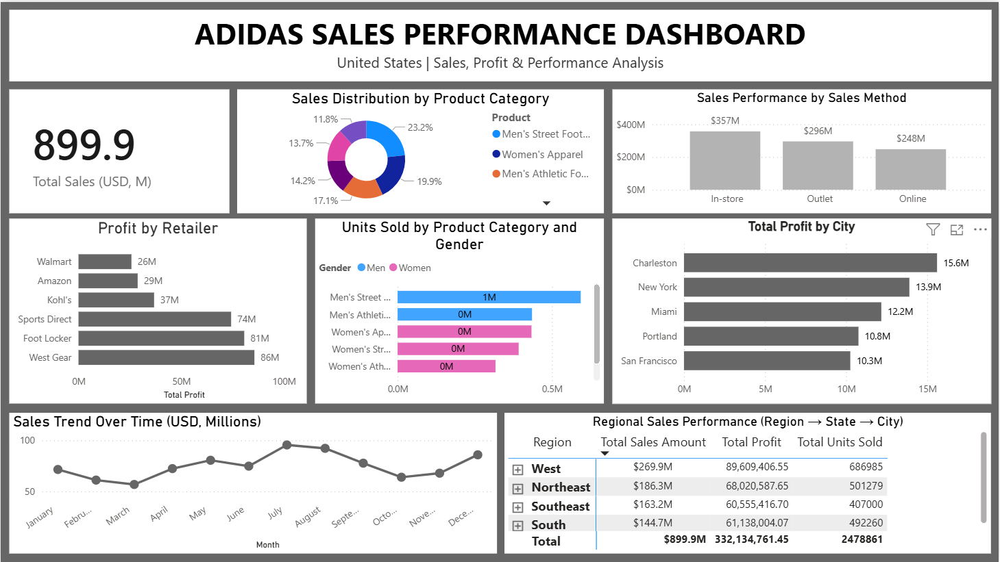

# Adidas Sales Performance Dashboard 🏃

## 📌 Overview
Interactive Power BI dashboard analyzing Adidas US sales performance
across regions, retailers, products and sales methods.

## 📊 Dashboard Highlights
- **Total Sales:** $899.9M across United States
- **Total Profit:** $332.1M
- **Total Units Sold:** 2,478,861

## 🔍 Key Insights
- West region leads with $269.9M in sales
- West Gear & Foot Locker are top performing retailers
- In-store sales dominate with $357M vs Online $248M
- Men's Street Footwear is the top selling category (23.2%)
- Charleston is the most profitable city ($15.6M)

## 📈 Visuals Included
- Sales Distribution by Product Category
- Sales Performance by Sales Method
- Profit by Retailer
- Units Sold by Product & Gender
- Total Profit by City
- Sales Trend Over Time
- Regional Sales Performance (Region → State → City)

## 🛠️ Tools Used
- Power BI Desktop
- Microsoft Excel (Data Source)
- DAX (Data Analysis Expressions)

## 📂 Files
- `Adidas_Sales_Dashboard.pbix` → Power BI Dashboard file
- `Adidas_Sales_Data.xlsx` → Raw dataset
- `screenshots/` → Dashboard preview images

## 🖼️ Dashboard Preview
